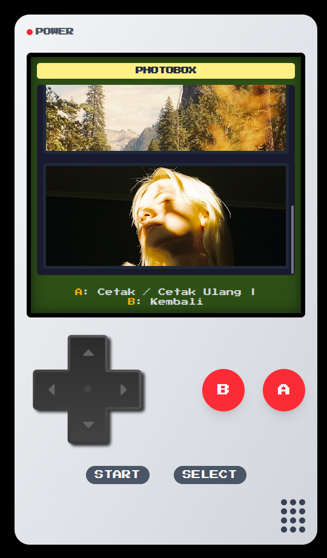
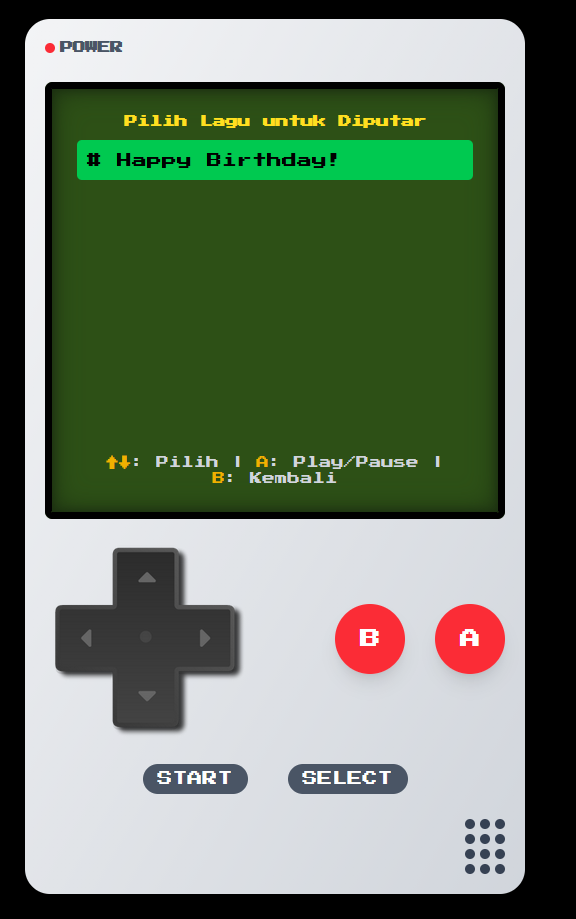
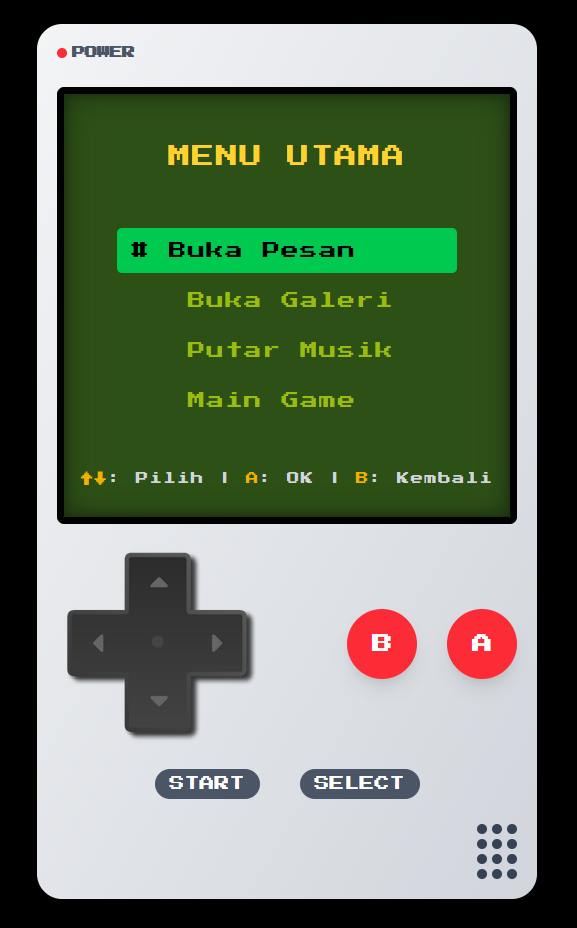
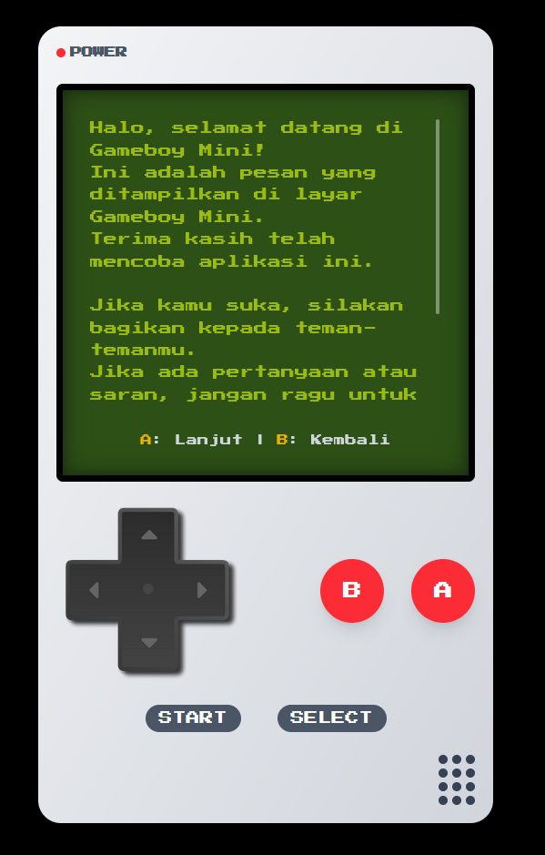
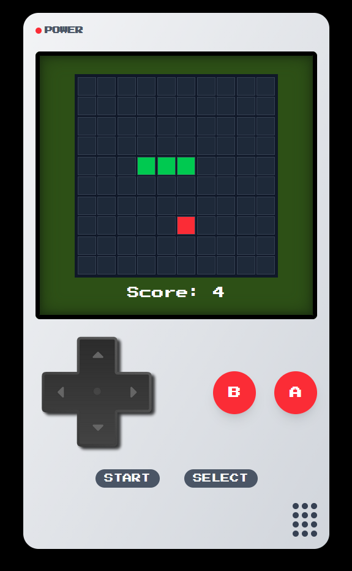
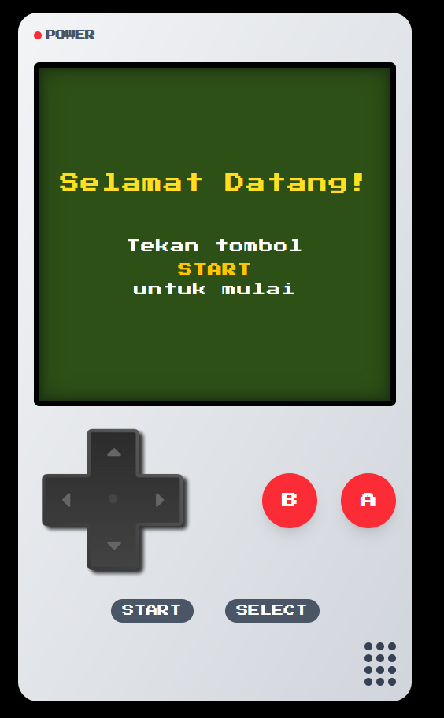

# Retro Gameboy UI - React + TypeScript 

UI bergaya **Gameboy klasik** menggunakan **React + TypeScript** dengan **Tailwind CSS**, penggunaan disarankan untuk mobile. Proyek ini menampilkan tombol fungsional, menu interaktif, galeri foto, musik, dan game ular klasik.

🔗 Coba di sini:
 
 

---

## Fitur Utama 

- **Tombol Navigasi**  
  - **D-Pad**: navigasi layar / gerakan game  
  - **Tombol A/B**: interaksi game & menu  
  - **START / SELECT**: kontrol menu utama dan fungsi tambahan  

- **Main Menu**
  - **Pesan personalisasi**: bisa diedit untuk ucapan ulang tahun, catatan, atau pesan pribadi.  

- **Galeri (Photo Box)**
  - Menampilkan foto-foto dalam resolusi layar Gameboy.  
  - Jumlah dan gambar bisa diubah sesuai keinginan.  

- **Putar Musik**
  - Playlist mini di UI Gameboy, musik bisa ditambahkan sendiri.  

- **Game Ular**
  - Game ular klasik dengan kontrol D-Pad.    
  - Reset / start game dapat dilakukan dengan tombol A / Enter.  
  - Kembali ke menu utama dengan tombol B.

---

## Screenshot Menu

| Galeri | Musik | Main Menu |
|--------|-------|-----------|
|  |  |  |

| Pesan | Snake Game | Menu Awal |
|-------|------------|---------------|
|  |  |  |

